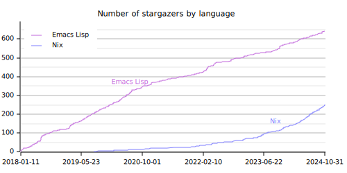
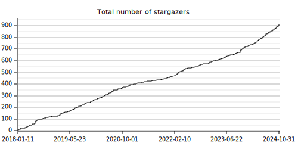

# YAStar: GitHub Star History for Your GitHub Profile

YAStar (Yet Another Star History) is a program that collects data from your
GitHub account and generates charts. It renders a line chart of stargazers given
to your public, owned, and original repositories, optionally grouped by primary
language. See examples:




It's not fancy, but it provides **useful insights on your expertise**.

It is a command-line program that is designed to be run on CI. With a small
setup, you can add the generated image to your GitHub readme.

**This program produces a [DuckDB](https://duckdb.org/) database.** You can use
YAStar to fetch your account data and then write your own script to produce
other presentations such as charts, tables, etc. for your slides and articles.

**DISCLAIMER: This project has nothing to do with YaST, a configuration tool for
openSUSE and SUSE operating systems.**

## Installation

As far as I know, this program is not packaged for any operating system yet.

It is a Rust application, so you can build the package using `cargo`:

``` shell
cargo install
```

It is also a Nix flake, so you can run the application directly without
installation:

``` shell
nix run github:akirak/yastar
```

## Configuration
To use the program, you have to set the following environment variables:

- `GITHUB_API_TOKEN`: Personal access token (PAT) for your GitHub account. You
  can [generate a new one](https://github.com/settings/tokens?type=beta) on
  settings. It is sufficient to use a fine-grained PAT with read-only access to
  public repositories.
- `DUCKDB_DATABASE`: Path to a DuckDB database file. If the file doesn't exist,
  a new one will be created.

This program also supports `.env`, so you can set the environment variables in
`.env` file in the running directory instead of setting them inside your shell.

## Usage

### Local Usage

First update the database from your GitHub account:

``` shell
yastar update
```

Then render a star history chart:

``` shell
yastar chart FILENAME.svg
```

Note that only SVG charts are supported at present.

The default chart type is the stargazer history by language. You can generate
a history of all stargazers by specifying `--type=total` option:

``` shell
yastar chart --type=total FILENAME.svg
```

You can browse the command line options with `--help`:

``` shell
yastar chart --help
```

### CI

**This program is heavy on API usage.** To prevent from hitting the API limit of
GitHub and also reduce the execution time, it is recommended to keep the
database to an object storage and restore it on every CI run. YAStar tries to
fetch only new activities, so you can save the usage by keeping the database
file.

## Technical Notes

- Unlike the popular [GitHub Readme
Stats](https://github.com/anuraghazra/github-readme-stats), YAStar takes
organization repositories into account. However, it only counts repositories
that look your original. To determine the originality, if the repository owner
is not the same as your login account, it checks at most 5 first commits of the
repository and skips the repository unless more than half of the commits are
authored by yourself.

- The number of stars shown on the chart can be larger than actual stars shown
  on your repositories. This is because the GitHub API returns activities of
  even removed stars.

## TODO

[ ] Allow customization of the charts to make them more beautiful.
