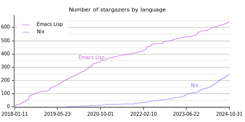

# YAStar: GitHub Star History for Your GitHub Profile

YAStar (Yet Another Star History) is a program that collects data from your
GitHub account and generates charts. It renders a stargazer history of your
public original repositories, optionally grouped by primary language. See
examples:




It's not fancy, but it provides **useful insights on your expertise**.

It is a command-line program that is designed to be run on CI. With a small
setup, you can add the generated image to your GitHub readme.

**This program produces a [DuckDB](https://duckdb.org/) database.** If you don't
like the charts produced by it, you can **use this program to fetch your account
data and then write your own scripts** to produce presentations such as charts,
tables, etc. for your slides and articles.

**DISCLAIMER: This project has nothing to do with YaST, a configuration tool for
openSUSE and SUSE operating systems.**

## Installation

As far as I know, this program is not packaged for any operating system yet.

### Nix

Run the program directly:

``` shell
nix run github:akirak/yastar -- [ARGS]
```

or add the default flake package to your NixOS/home-manager configuration.

A binary cache is provided from `https://akirak.cachix.org`.

### Building from source

It is a Rust application, so you can build the package using `cargo`.

You need DuckDB as a dependency.

``` shell
cargo install
```
## Configuration
To use the program, you have to set the following environment variables:

- `GITHUB_API_TOKEN`: Personal access token (PAT) for retrieving data. You can
  [generate a new one](https://github.com/settings/tokens?type=beta) on your
  GitHub account. It is sufficient to use a fine-grained PAT with read-only
  access to public repositories.
- `DUCKDB_DATABASE`: Path to a database file of DuckDB. If the file doesn't
  exist, a new one will be created.

This program also supports `.env`, so you can set the environment variables in
`.env` file instead of setting them inside your shell.

## Usage

### Local Usage

First update the database from your GitHub account:

``` shell
yastar update
```

Then render a star history chart:

``` shell
yastar chart FILENAME.svg
```

Note that only SVG charts are supported at present.

The default chart type is the stargazer history by language. You can generate
a history of all stargazers by specifying `--type=total` option:

``` shell
yastar chart --type=total FILENAME.svg
```

You can browse the command line options with `--help`:

``` shell
yastar chart --help
```

### CI

**This program is heavy on API usage**, especially if you have repositories with
thousands (or more) of commits. To prevent from hitting the API limit of GitHub
and also reduce the execution time, it is recommended to keep the database to an
object storage and restore it on every CI run. YAStar tries to fetch only new
activities, so you can save the usage by keeping the database file.

## Technical Notes

- Unlike the popular [GitHub Readme
Stats](https://github.com/anuraghazra/github-readme-stats), YAStar takes
organization repositories into account. However, it only counts repositories
that look your original. To determine the originality, if the repository owner
is not the same as your login account, it checks at most 5 first commits of the
repository and skips the repository unless more than half of the commits are
authored by yourself.

- The number of stars shown on the chart can be larger than actual stars shown
  on your repositories. This is because the GitHub API returns activities of
  even removed stars.

- Languages with a small number of stargazers are not rendered on the language
  chart. The threshold is 10 stars at present.

## TODO

[ ] Allow customization of the charts to make them more beautiful.
[ ] Allow customization of the threshold.
[ ] Add thorough documentation on CI setup.
